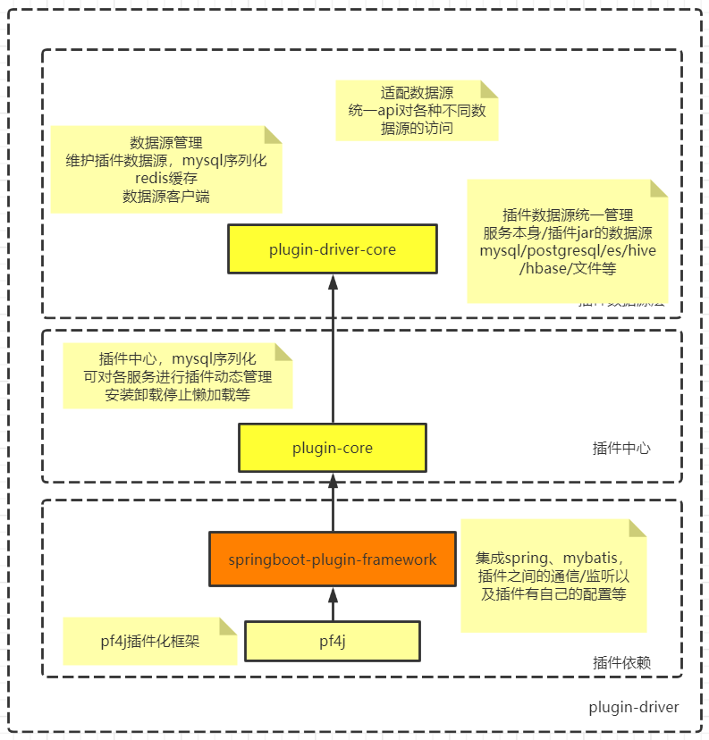

# plugin-driver-parent

## 1. 简介

### 1.1 背景

数据中台中数据服务模块，需要适配各种数据源，如rdb、elasticsearch、redis、hive、hbase、impala、presto、kudu等各种传统关系型数据库以及大数据查询组件等，进行统一接口查询，进行提供服务给下游，如报表、大屏等。

### 1.2 项目简介

plugin-driver基于此需求下而开发，采用插件架构，可适配上述各种数据源，可直接返回datasource（这里的datasource是个统称，可代表```javax.sql.DataSource```、```Jedis```等操作具体数据源的对象）给下游服务，下游服务可基于此datasource进行操作，如获取connection进行db的ddl/dml等操作。我们也提供了常用接口（如table/schema/元数据/分区等），可直接使用。

当然，plugin-driver高度扩展，可根据需求自行开发插件。

> 代码模块简介

```
plugin-driver-parent
    ├── plugin-core
    ├── plugin-driver-core
    ├── plugin-driver-runner
    └── plugins
        ├── driver-mysql5
        ├── driver-postgresql
        ├── driver-es7
        ├── ......
        └── out
            ├── disabled.txt
            ├── enabled.txt
            ├── driver-mysql5@1.0.0.jar
            ├── driver-postgresql@1.0.0.jar
            ├── driver-es7@1.0.0.jar
            └── ......
```

结构这里简单讲一下，后文会各个模块详细讲解：

1. plugin-core是插件中心，对插件的管理，如插件的创建/安装/卸载/停止/懒加载等一些对插件的操作、以及一些工具类、全局异常等处理。
2. plugin-driver-core是插件数据源中心，根据数据源信息获取插件定义的datasource，也可获取该服务的本身数据源，即配置的spring.datasouce。然后基于此datasource，统一接口，适配多种数据源。
3. plugin-driver-runner可以本地启动，集成swagger，方便接口调试。
4. plugins是插件模块，包含一系列插件，这里主要是数据源的插件。
5. plugins/out是插件jar的打包目录，里面有插件的配置文件以及插件jar等，启动时会去加载这些jar，可通过配置disabled.txt/enabled.txt去选择加载的插件jar，也可设置plugin.plugin-init-load模糊匹配插件进行加载。

## 2. 项目架构



本项目采用[pf4j](https://github.com/pf4j/pf4j)作为插件化框架，用其管理插件的生命周期，基于pf4j开发了[springboot-plugin-framework](https://github.com/codingdebugallday/springboot-plugin-framework-parent)，方便spring boot项目使用，也扩展了很多点，如集成spring、mybatis，插件之间的通信/监听以及插件有自己的配置等。

在[springboot-plugin-framework](https://github.com/codingdebugallday/springboot-plugin-framework-parent)上，开发了plugin-driver-datasource，数据源插件化，可获取多种数据源；开发了plugin-driver-session，数据源接口插件化，一套接口可适配多种数据源，屏蔽底层实现细节。

## 3. 插件中心

详情请看[插件中心](plugin-core.md)

## 4. 插件开发

详情请看[插件开发指导](plugin-dev.md)

## 5. 接口

> 数据源元数据

详情请看[数据源元数据](metadata.md)

## 6. 数据源监控

todo